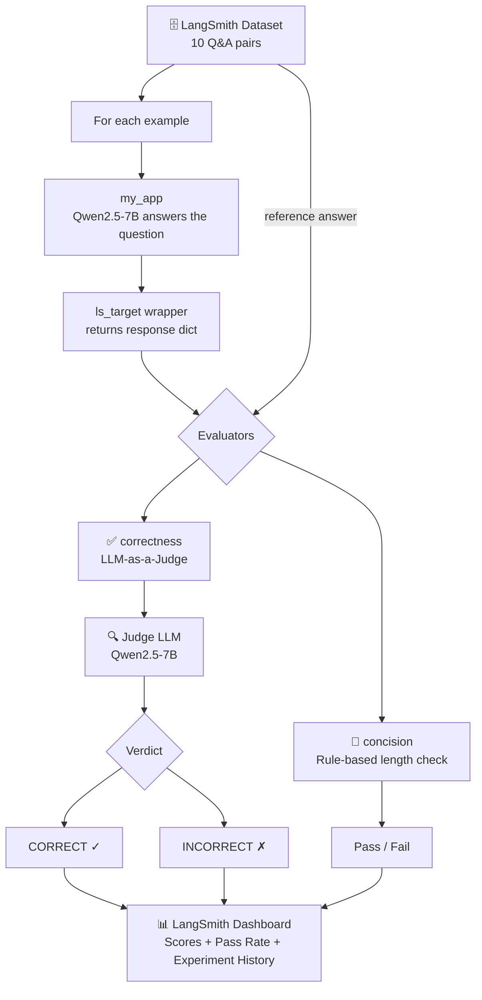
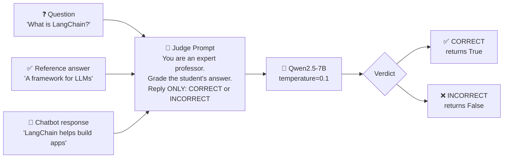
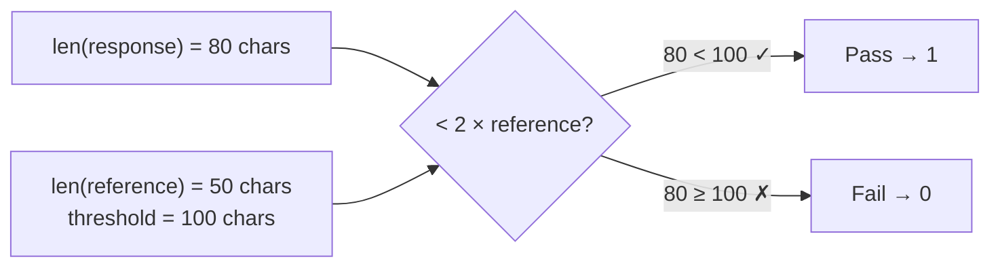
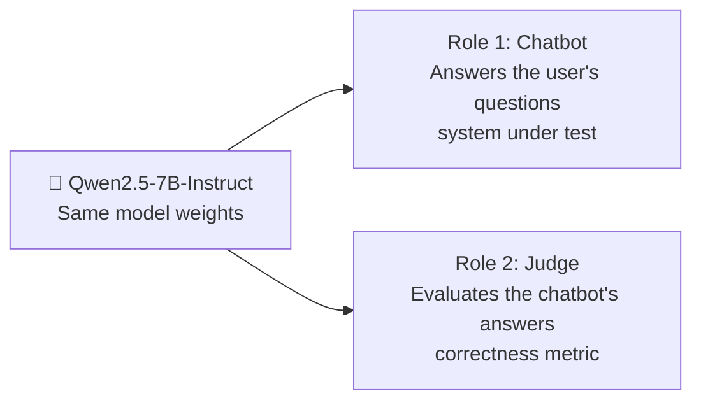
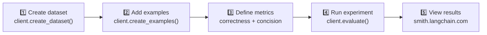

# 🤖 Chatbot Evaluation using LLM as a Judge

A framework for automatically evaluating chatbot responses using a local LLM as a judge, integrated with LangSmith for experiment tracking and observability.

---

## 📌 Overview

This project implements an **automated evaluation pipeline** for LLM-based chatbots. Instead of manually grading chatbot responses, we use another LLM (acting as a "judge") to score them — a technique known as **LLM-as-a-Judge**.

The evaluation is tracked and visualized using **LangSmith**, a platform for monitoring and evaluating LLM applications.

---

## 🧠 What is LLM as a Judge?

**LLM-as-a-Judge** is an evaluation technique where a language model automatically assesses the quality of another model's output.

The judge LLM receives three inputs:

1. The original **question**
2. The **reference (correct) answer** — ground truth
3. The **chatbot's actual response**

It then returns a verdict: `CORRECT` or `INCORRECT`.

This approach scales evaluation to thousands of examples without requiring human annotators for every test case.

**Why does this matter?**

| Approach | Scale | Cost | Consistency |
|---|---|---|---|
| Human review | Low | High | Variable |
| Rule-based checks | High | Low | High (but limited) |
| LLM-as-a-Judge | High | Medium | High |

---

## 🏗️ Full Pipeline



---

## 🔍 How the Judge Works

The `correctness` evaluator sends a carefully crafted prompt to the judge LLM:



The prompt is deliberately strict:
- The judge is told to respond with **one word only**
- Low temperature (`0.1`) makes the output deterministic
- The judge acts as an "expert professor grading a student"

---

## 📐 Evaluation Metrics

### Metric 1: Correctness (LLM-as-a-Judge)

```python
def correctness(inputs: dict, outputs: dict, reference_outputs: dict) -> bool:
    user_content = f"""You are grading a student's answer.
        Question: {inputs['question']}
        Correct Answer: {reference_outputs['answer']}
        Student Answer: {outputs['response']}

        Instructions:
        - Respond with ONLY one word.
        - Allowed answers: CORRECT or INCORRECT

        grade:"""

    # ... calls Qwen2.5-7B as judge ...
    return response.strip() == "CORRECT"
```

### Metric 2: Concision (Rule-based)

Checks whether the chatbot's response is not overly verbose — specifically, less than **2x the length** of the reference answer:

```python
def concision(outputs: dict, reference_outputs: dict) -> bool:
    response = outputs.get('response', "")
    return int(len(response) < 2 * len(reference_outputs['answer']))
```



---

## ⚠️ The Dual-Role Model

In this project, **Qwen2.5-7B-Instruct plays two roles simultaneously**:



> ⚠️ **Note:** Using the same model as both the chatbot and judge can introduce bias — the model may be lenient with its own outputs. In production, use a stronger, separate model (e.g. GPT-4o or Claude) as the judge.

---

## 🗄️ Dataset

The dataset consists of 10 Q&A pairs about AI tools and companies, stored in LangSmith:

| Question | Reference Answer |
|---|---|
| What is LangChain? | A framework for building LLM applications |
| What is LangSmith? | A platform for observing and evaluating LLM applications |
| What is OpenAI? | A company that creates Large Language Models |
| What is Hugging Face? | A company that provides tools and models for NLP |
| What is TensorFlow? | An open-source ML framework developed by Google |
| What is PyTorch? | An open-source ML library for deep learning |
| What is Anthropic? | A company that develops AI systems and LLMs |
| What is Cohere? | A company that provides language AI models and APIs |
| What is Google? | A technology company known for search |
| What is Mistral? | A company that creates Large Language Models |

---

## 🛠️ Tech Stack

| Component | Tool |
|---|---|
| LLM (Chatbot + Judge) | `Qwen/Qwen2.5-7B-Instruct` |
| Model loading | `transformers` (HuggingFace) |
| LLM Framework | `LangChain` + `langchain_huggingface` |
| Evaluation & Tracing | `LangSmith` |
| Runtime | Google Colab (GPU — T4 or better) |

---

## 🚀 Setup & Installation

### 1. Install dependencies

```bash
pip install --pre -U langchain langchain-openai langchain_community \
    langchain_core langchain_text_splitters unstructured \
    langchain_huggingface langchain_cohere
```

### 2. Set up LangSmith API key

In Google Colab, store your key as a secret named `LANGSMITH`:

```python
from google.colab import userdata
import os

os.environ['LANGCHAIN_TRACING'] = 'true'
os.environ['LANGCHAIN_API_KEY'] = userdata.get('LANGSMITH')
```

### 3. Load the model

```python
from transformers import AutoModelForCausalLM, AutoTokenizer

model_name = "Qwen/Qwen2.5-7B-Instruct"

model = AutoModelForCausalLM.from_pretrained(
    model_name,
    torch_dtype="auto",
    device_map="auto"
)
tokenizer = AutoTokenizer.from_pretrained(model_name)
```

---

## ▶️ Running the Evaluation



```python
experiment_results = client.evaluate(
    ls_target,                             # chatbot wrapper
    data="Chatbot evaluation",             # dataset name in LangSmith
    evaluators=[correctness, concision],   # metrics
    experiment_prefix="Qwen/Qwen2.5-7B-Instruct"
)
```

---

## 📈 Results

LangSmith provides after each run:

- **Per-example scores** — True/False for each metric on each question
- **Aggregate pass rate** — overall % correct across the dataset
- **Experiment history** — compare multiple model versions side by side

View results at: [smith.langchain.com](https://smith.langchain.com)

---

## 📁 Project Structure

```
📦 Chatbot_Evaluation
 ┣ 📓 Chatbot_Evaluation.ipynb   # Main notebook
 ┗ 📄 README.md                  # This file
```

---

## 💡 Key Concepts

| Concept | Description |
|---|---|
| **LLM-as-a-Judge** | Using an LLM to automatically evaluate another LLM's outputs |
| **LangSmith Dataset** | A curated set of input/output pairs used as ground truth |
| **Evaluator function** | A Python function that scores a chatbot response (returns bool or int) |
| **Experiment** | A single evaluation run tracked in LangSmith with a name/prefix |
| **Concision** | A rule-based metric checking response length vs. expected length |
| **Ground truth** | The reference (correct) answer used to benchmark the chatbot |

---

## ⚠️ Important Notes

- Designed for **Google Colab** with GPU runtime (T4 or better for Qwen2.5-7B)
- The same model is used as both chatbot and judge — consider a stronger judge in production
- Strip notebook outputs before sharing: `nbstripout Chatbot_Evaluation.ipynb`