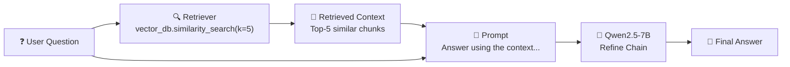
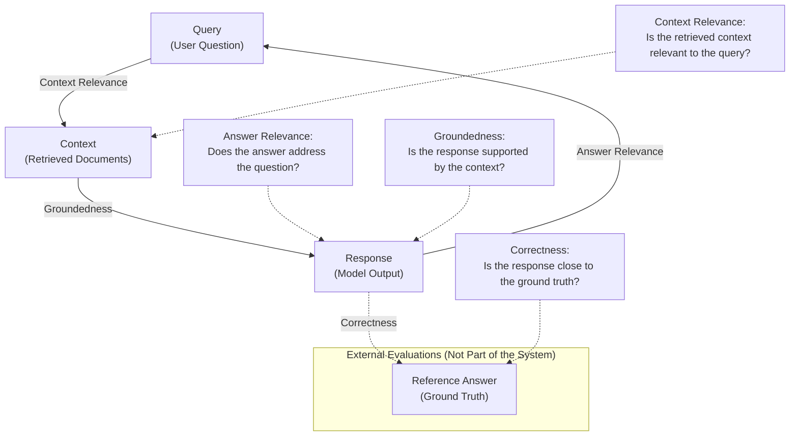
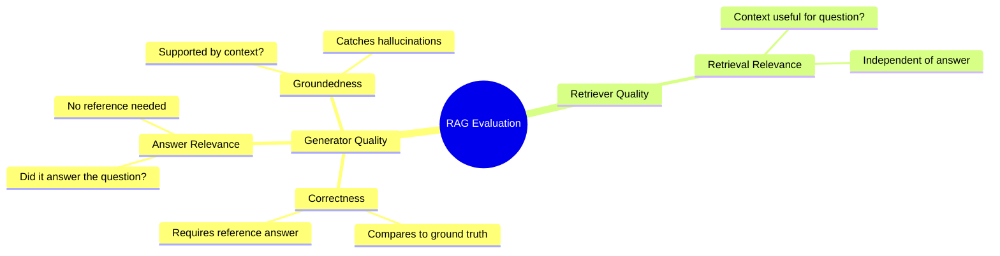
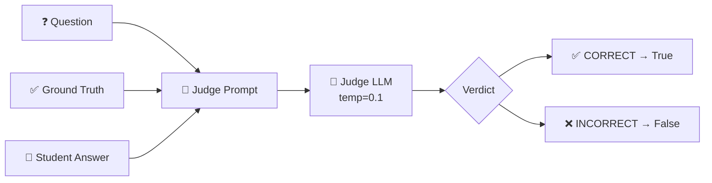
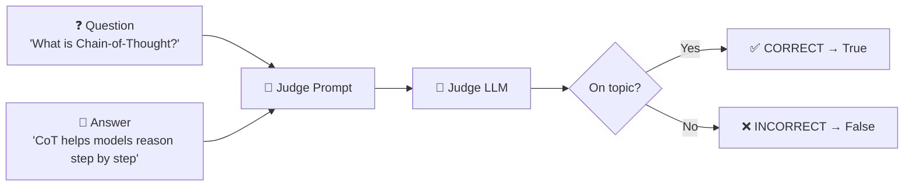
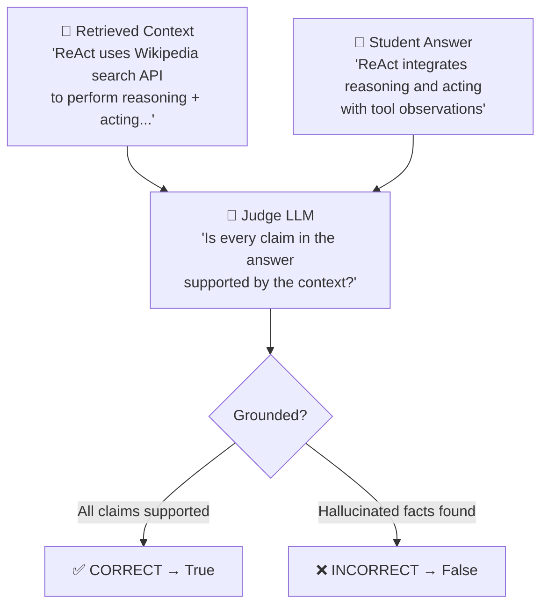
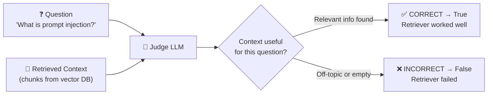
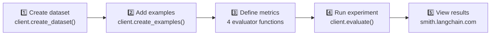

# 🤖 RAG Evaluation using LLM as a Judge

A framework for automatically evaluating RAG (Retrieval-Augmented Generation) pipeline responses using a LLM as a judge, integrated with LangSmith for experiment tracking and observability.

---

## 📌 Overview

This project implements an **automated evaluation pipeline** for RAG-based chatbots. Instead of manually grading responses, we use another LLM (acting as a "judge") to score them — a technique known as **LLM-as-a-Judge**.

The evaluation covers **4 key metrics** that holistically measure RAG quality, all tracked and visualized using **LangSmith**.

---

## 🧠 What is RAG?

**Retrieval-Augmented Generation (RAG)** is a pattern where the LLM doesn't answer from memory alone — it first retrieves relevant documents from a knowledge base (e.g., a vector database), then generates an answer grounded in that retrieved context.



---

## 🧠 What is LLM as a Judge?

**LLM-as-a-Judge** is an evaluation technique where a language model automatically assesses the quality of another model's output, replacing slow and expensive human annotation.

The judge LLM receives a carefully structured prompt and returns a verdict.

**Why does this matter?**

| Approach | Scale | Cost | Consistency |
|---|---|---|---|
| Human review | Low | High | Variable |
| Rule-based checks | High | Low | High (but limited) |
| LLM-as-a-Judge | High | Medium | High |

---

## 🏗️ Full Evaluation Pipeline



---

## 📐 Evaluation Metrics (4 Metrics)

RAG systems have **two components that can fail**: the retriever and the generator. The 4 metrics below cover both.



---

### Metric 1: ✅ Correctness — Response vs Reference Answer

**Goal:** Measure how accurate the RAG answer is compared to a known ground-truth answer.

**Requires:** Reference answer (ground truth from dataset).

**Judge prompt role:** "You are a teacher grading a quiz."

**Grading criteria:**
- Answer must be factually accurate relative to ground truth
- No conflicting statements allowed
- Extra (accurate) information is OK

```python
def correctness(inputs: dict, outputs: dict, reference_outputs: dict) -> bool:
    user_content = f"""
    QUESTION: {inputs['question']}
    GROUND TRUTH ANSWER: {reference_outputs['answer']}
    STUDENT ANSWER: {outputs['answer']}

    Instructions:
    - Respond with ONLY one word.
    - Allowed answers: CORRECT or INCORRECT
    grade:"""
    # ... calls Qwen2.5-7B as judge ...
    return response.strip() == "CORRECT"
```



---

### Metric 2: Answer Relevance — Response vs Input Question

**Goal:** Did the model actually address what the user asked, regardless of accuracy?

**Requires:** Only the question and the answer — no reference needed.

**Grading criteria:**
- Answer must directly address the question
- Must stay on topic
- Extra relevant info is OK, but off-topic content fails

```python
def relevance(inputs: dict, outputs: dict) -> bool:
    user_content = f"""
    QUESTION: {inputs['question']}
    STUDENT ANSWER: {outputs['answer']}

    Instructions:
    - Respond with ONLY one word: CORRECT or INCORRECT
    grade:"""
    # ... no reference_outputs needed ...
    return response.strip() == "CORRECT"
```



> ℹ️ **Note:** This metric catches cases where the RAG bot gives a technically accurate answer to the *wrong question* (e.g., answering about RAG when asked about Tree of Thoughts).

---

### Metric 3: 📎 Groundedness — Response vs Retrieved Context

**Goal:** Is every claim in the answer actually supported by the retrieved documents? This is the primary metric for **catching hallucinations**.

**Requires:** The retrieved context chunks and the answer.

**Grading criteria:**
- Every statement must be supported by the retrieved context
- Hallucinated or fabricated facts → False
- Shorter answers that omit context details are fine, as long as included facts are grounded

```python
def groundedness(inputs: dict, outputs: dict) -> bool:
    user_content = f"""
    CONTEXT: {outputs['context']}   # retrieved docs
    STUDENT ANSWER: {outputs['answer']}

    Instructions:
    - Respond with ONLY one word: CORRECT or INCORRECT
    grade:"""
    return response.strip() == "CORRECT"
```



---

### Metric 4: 🔍 Retrieval Relevance — Context vs Question

**Goal:** Did the retriever actually fetch useful documents for the question? A RAG system can fail at the *retrieval* step before generation even starts.

**Requires:** The question and the retrieved context.

**Grading criteria:**
- Retrieved context must contain information relevant to the question
- If context is off-topic or missing key info → False
- Extra information in context is OK

```python
def retrieval_relevance(inputs: dict, outputs: dict) -> bool:
    user_content = f"""
    QUESTION: {inputs['question']}
    RETRIEVED CONTEXT: {outputs['context']}

    Instructions:
    - Respond with ONLY one word: CORRECT or INCORRECT
    grade:"""
    return response.strip() == "CORRECT"
```



---

## 📊 Metrics at a Glance

| Metric | Inputs Used | Needs Reference? | What it Catches |
|---|---|---|---|
| **Correctness** | Question + Answer + Ground Truth | ✅ Yes | Factually wrong answers |
| **Answer Relevance** | Question + Answer | ❌ No | Off-topic answers |
| **Groundedness** | Context + Answer | ❌ No | Hallucinations |
| **Retrieval Relevance** | Question + Context | ❌ No | Bad retrieval |


---

## 🛠️ Tech Stack

| Component | Tool |
|---|---|
| LLM (RAG Bot + Judge) | `Qwen/Qwen2.5-7B-Instruct` |
| RAG Chain Type | `refine` (LangChain) |
| Vector Store | LangChain Vector DB (`similarity_search`) |
| Model loading | `transformers` (HuggingFace) |
| LLM Framework | `LangChain` + `langchain_huggingface` |
| Evaluation & Tracing | `LangSmith` |
| Runtime | Google Colab (GPU — T4 or better) |

---

## 🚀 Setup & Installation

### 1. Install dependencies

```bash
pip install --pre -U langchain langchain-openai langchain_community \
    langchain_core langchain_text_splitters unstructured \
    langchain_huggingface langchain_cohere
```

### 2. Set up LangSmith API key

In Google Colab, store your key as a secret named `LANGSMITH`:

```python
from google.colab import userdata
import os

os.environ['LANGCHAIN_TRACING'] = 'true'
os.environ['LANGCHAIN_API_KEY'] = userdata.get('LANGSMITH')
```

### 3. Load the model

```python
from transformers import AutoModelForCausalLM, AutoTokenizer

model_name = "Qwen/Qwen2.5-7B-Instruct"

model = AutoModelForCausalLM.from_pretrained(
    model_name,
    torch_dtype="auto",
    device_map="auto"
)
tokenizer = AutoTokenizer.from_pretrained(model_name)
```

---

## 🗄️ Dataset

The evaluation uses **10 Q&A pairs** covering LLM / agent topics, stored in LangSmith:

```python
examples = [
    {"inputs": {"question": "How does the ReAct agent use self-reflection?"},
     "outputs": {"answer": "ReAct integrates reasoning and acting..."}},
    {"inputs": {"question": "What are the types of biases in few-shot prompting?"},
     "outputs": {"answer": "Majority label bias, Recency bias, Common token bias."}},
    # ... 8 more examples
]

dataset = client.create_dataset(dataset_name="RAG Evaluation")
client.create_examples(dataset_id=dataset.id, examples=examples)
```

Topics covered: ReAct agents, Chain-of-Thought, self-consistency, Tree of Thoughts, prompt injection, adversarial attacks, RAG, autonomous agents, and more.

---

## ▶️ Running the Evaluation



```python
def target(inputs: dict) -> dict:
    return rag_bot(inputs["question"])

experiment_results = client.evaluate(
    target,
    data="RAG Evaluation",
    evaluators=[correctness, groundedness, relevance, retrieval_relevance],
    experiment_prefix="rag-doc-relevance",
    metadata={"version": "Qwen2.5-7B-Instruct-V1.0"}
)

experiment_results.to_pandas()
```

---

## 📈 Results

LangSmith provides after each run:

- **Per-example scores** — True/False for each of the 4 metrics on each question
- **Aggregate pass rate** — overall % correct across the dataset per metric
- **Experiment history** — compare multiple model versions or prompt variations side by side

View results at: [smith.langchain.com](https://smith.langchain.com)


---

## 💡 Key Concepts

| Concept | Description |
|---|---|
| **RAG** | Retrieval-Augmented Generation — answer from retrieved documents, not model memory |
| **Refine Chain** | Iteratively improves answer using each retrieved document one at a time |
| **LLM-as-a-Judge** | Using an LLM to automatically evaluate another LLM's outputs |
| **Correctness** | Factual accuracy of answer vs. ground truth reference |
| **Answer Relevance** | Whether the answer addresses the user's actual question |
| **Groundedness** | Whether the answer is fully supported by retrieved context (no hallucinations) |
| **Retrieval Relevance** | Whether the retriever fetched useful documents for the question |
| **LangSmith Dataset** | A curated set of input/output pairs used as ground truth |
| **Evaluator function** | A Python function that scores a chatbot response (returns bool) |
| **Experiment** | A single evaluation run tracked in LangSmith with a name/prefix |

---

# Tech Stack

| Component | Tool |
|------------|--------|
| LLM | Transformers |
| Model | Qwen2.5-7B |
| Vector DB | :contentReference[oaicite:4]{index=4} |
| Embeddings | :contentReference[oaicite:5]{index=5} |
| Evaluation | :contentReference[oaicite:6]{index=6} |
| Framework | :contentReference[oaicite:7]{index=7} |
